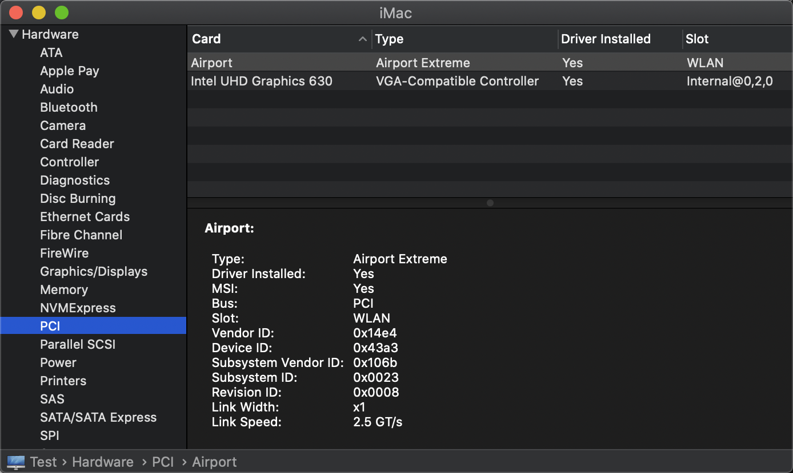
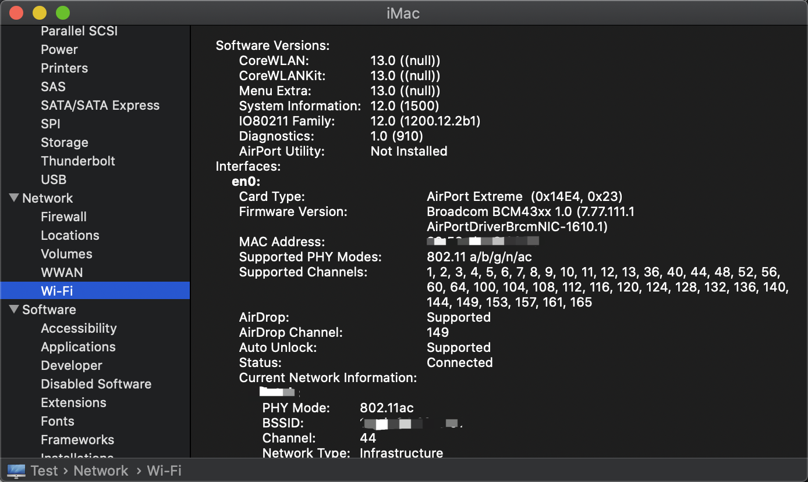

# MacOS10.15.7 Base on AsRock H470m_itx (OpenCore 0.5.8)

## Hardware info

- Motherboard：ASRock H470M-ITXN
- CPU: Intel i5-10400
- Graphics: Intel UHD Graphics 630 3072 MB
- WIFI/Bluetooth：DW1820A (94365ZE)
- SSD：KioXia RC10 1T
- Memory：CUSO 8G 2667DDR4 x2
- Displays：PHL 288E2 4k

## Other

- Work: :ballot_box_with_check AirDrop :ballot_box_with_check 4K by DP :ballot_box_with_check AirPods :ballot_box_with_check Apple Wireless Keyboard
- UHD630 connection 4k display needs to use DP cable
- Bluetooth will fail work 4 hours, It can work in good condition after configurate the USB Port, visit the link:[The New Beginner's Guide to USB Port Configuration](https://www.tonymacx86.com/threads/the-new-beginners-guide-to-usb-port-configuration.286553/)   (case by case)
- Realtek RTL8125 2.5G cant work: [Realtek RTL8125 2.5G网卡黑苹果无法识别显示未连接驱动解决方法](http://k61.org/d6113fd5.html?ivk_sa=1024320u)

## Update

- [2021-05-09] Sensor: Add sensor support get cpu temperature and frequency (but cant get cpu fans)
- [2021-05-09] MacOS 10.15.7 Support: Support Upgrade to 10.15.7

## Screenshot

