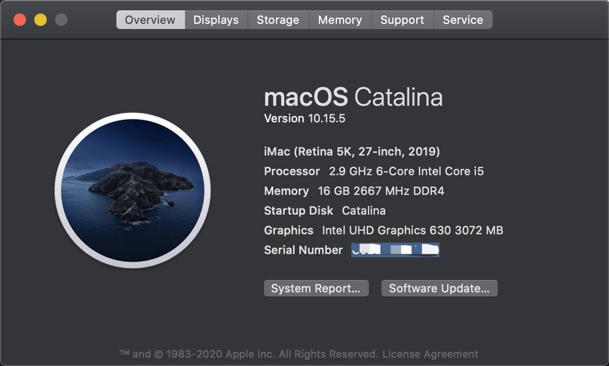
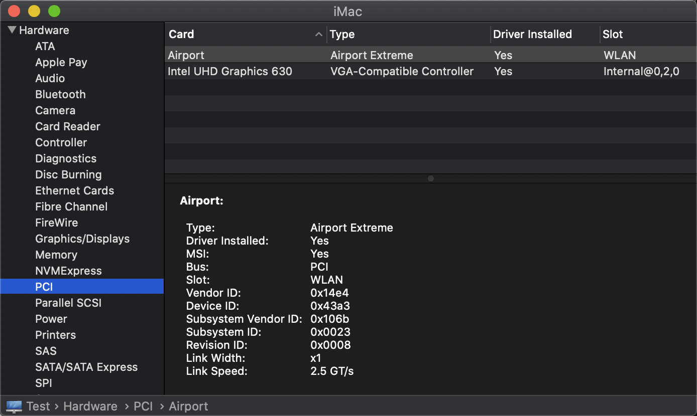
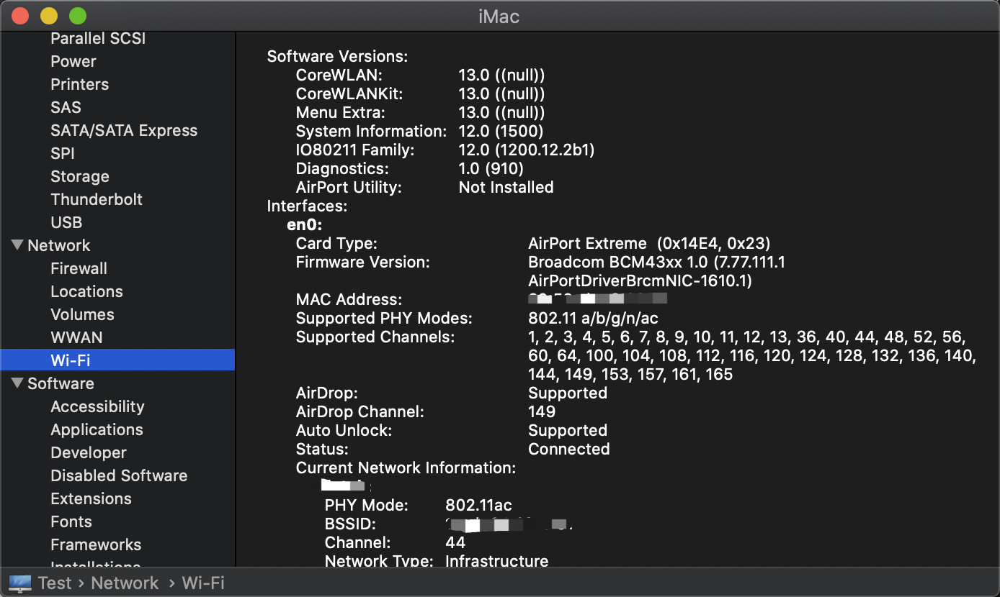
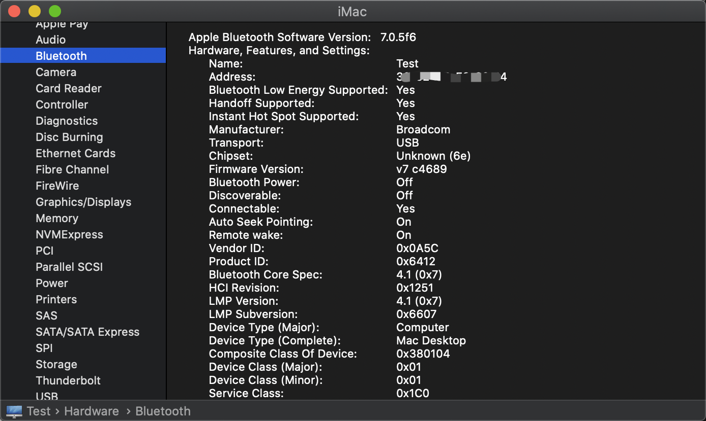
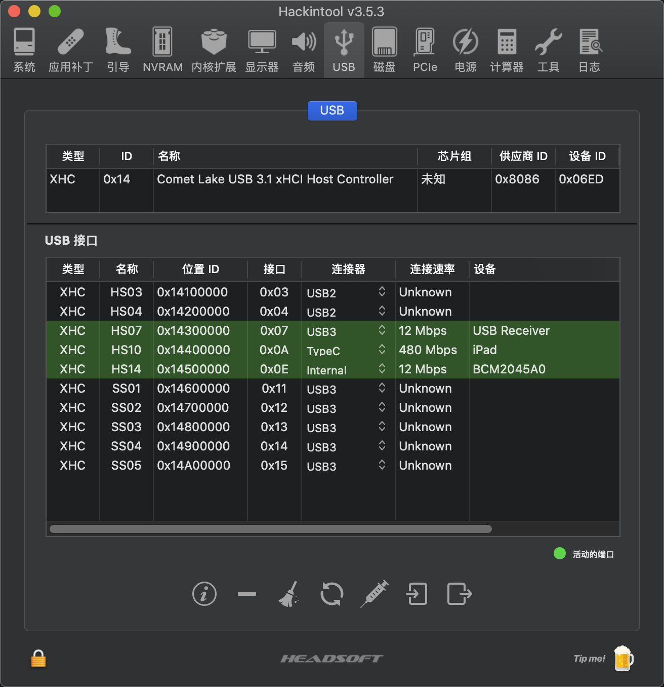

# 华擎H470m_itx主板 MacOS 10.15.7,OpenCore 0.5.8

## 硬件信息

- 主板：ASRock H470M-ITX
- 主板: Intel i5-10400
- 显卡: Intel UHD Graphics 630 3072 MB
- WIFI/蓝牙：DW1820A (94365ZE)
- SSD：KioXia RC10 1T
- 内存：CUSO 8G 2667DDR4 x2
- 显卡器：PHL 288E2 4k

## 其它

- 几个关键指标: :ballot_box_with_check 隔空投送 :ballot_box_with_check DP连接4K :ballot_box_with_check AirPods :ballot_box_with_check Apple Wireless Keyboard
- 核显UHD630需要用DP线才能4k 60hz，HDMI连接时黑屏，因为60hz显示不了，如果借个1080p显示器可以改4k显示器为30hz就能显示了
- 蓝牙还是不稳定，一般4-5小时后就显示没设备，可能是USB端口的问题，定制了USB端口内建(H470M_ITX，删除了LED灯的端口映射)，目前正常中；
- Realtek RTL8125 2.5G网卡已驱动但显示电缆可能未插好，解决方案：[Realtek RTL8125 2.5G网卡黑苹果无法识别显示未连接驱动解决方法](http://k61.org/d6113fd5.html?ivk_sa=1024320u)

## Update

- [2021-05-09] 传感器: 支持CPU温度、时钟频率 (CPU风扇因更换乔思伯未获取到风扇转速)
- [2021-05-09] MacOS 10.15.7支持: 支持升级至10.15.7

## 截图

